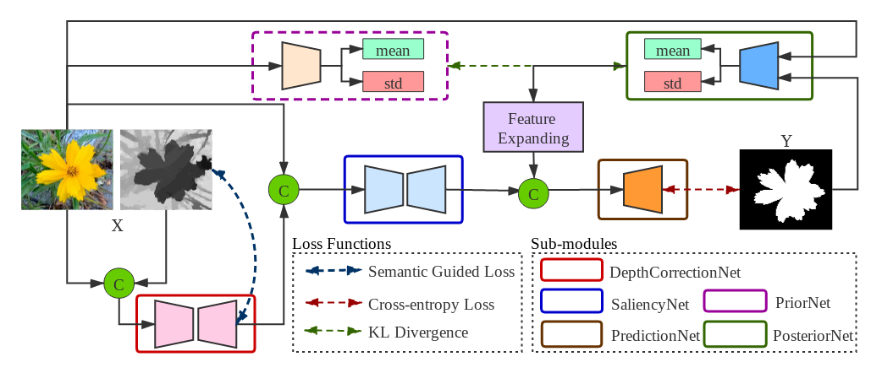
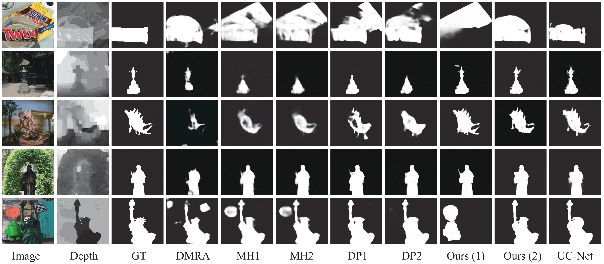
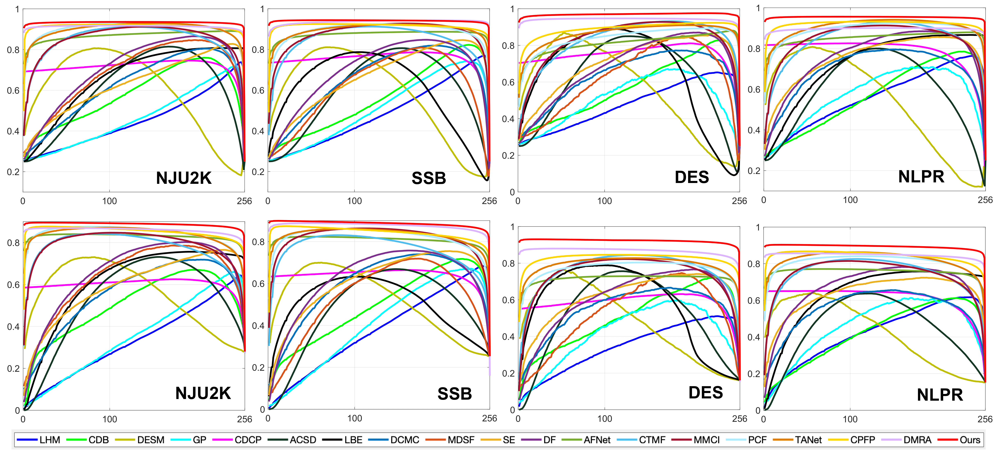

# UCNet (CVPR2020)
UC-Net: Uncertainty Inspired RGB-D Saliency Detection via Conditional Variational Autoencoders

# Setup 

Install Pytorch

# Train Model

1. Download training data from: https://drive.google.com/file/d/1zslnkJaD_8h3UjxonBz0ESEZ2eguR_Zi/view?usp=sharing, and put it in folder "data"

2. Run ./train.py

# Test Model

1. Download the trained model from: https://drive.google.com/file/d/1nzGLnlmntTGbcaShfQvE6ouyfWJD-pIB/view?usp=sharing, and put it in folder "models"

2. Download the testing dataset from: https://drive.google.com/file/d/1n1bEfw3lzI6p8u1xaxEqnuEXgNqbAFTA/view?usp=sharing, and put it in folder "test_dataset"

3. Modify testing image path in "test.py" accordingly

4. Run ./test.py

# Our results:

1. Results of our model on six benchmark datasets can be found: https://drive.google.com/open?id=1NVJVU8dlf2d9h9T8ChXyNjZ5doWPYhjg or: 链接: https://pan.baidu.com/s/1M9_Bv16-tTnlgF6ayBmc6w 提取码: u8s5

2. Performance of our method can be found: https://drive.google.com/open?id=1vacU51eG7_r751lAsjKTPSGrdjzt_Z4H or: 链接: https://pan.baidu.com/s/1o6kFY8Y81_V-pftc8kTgUw 提取码: fqpd

# Performance of competing methods

Performance of competing methods can be found: https://drive.google.com/open?id=1NUMp_zKXSx8jc7u7HnPQmcYXtoiLWj6t or: 链接: https://pan.baidu.com/s/1g1dbwsGowLD_FFAx0ciSHw 提取码: sqar 

# Our Bib:

Please cite our paper if you like our work:

@inproceedings{Zhang2020UCNet,
  title={UC-Net: Uncertainty Inspired RGB-D Saliency Detection via Conditional Variational Autoencoders},
  author={Zhang, Jing and Fan, Deng-Ping and Dai, Yuchao and Anwar, Saeed and Sadat Saleh, Fatemeh and Zhang, Tong and Barnes, Nick},
  booktitle={Proceedings of the IEEE conference on computer vision and pattern recognition},
  year={2020}
}

# Benchmark RGB-D SOD

The complete RGB-D SOD benchmark can be found in this page:

http://dpfan.net/d3netbenchmark/

# Contact

Please contact me for further problems or discussion: zjnwpu@gmail.com

